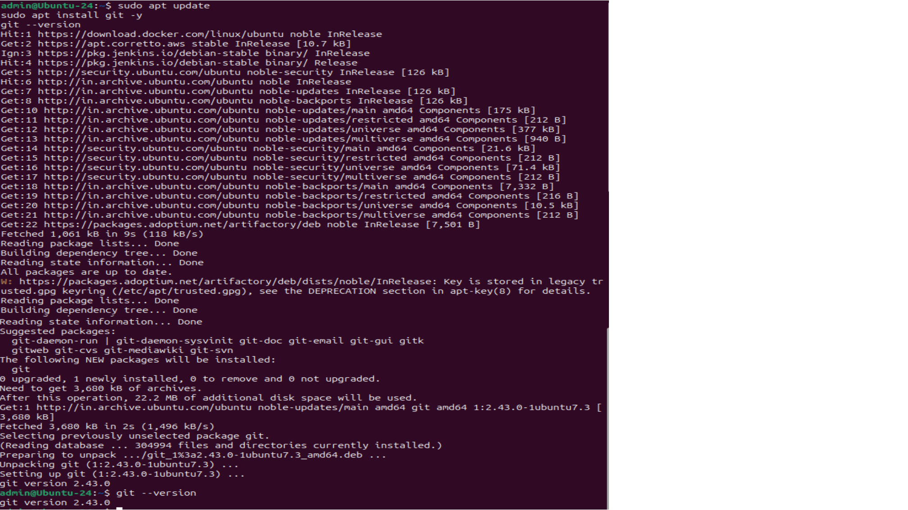
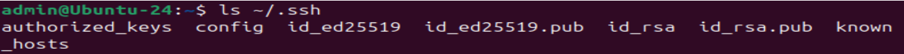

---

# Git Installation and Configuration Guide


---

## Overview

This repository provides **enterprise-standard, step-by-step instructions** for installing, configuring, upgrading, securing (SSH), and uninstalling Git across common platforms.
Intended for **developers, DevOps engineers, and system administrators**.

---

## Table of Contents

* [Supported Platforms](#supported-platforms)
* [Git Installation](#git-installation)

  * [Ubuntu / AWS Ubuntu](#ubuntu--aws-ubuntu)
  * [CentOS / RHEL](#centos--rhel)
  * [Amazon Linux](#amazon-linux)
  * [Windows](#windows)
* [Post-Installation Configuration](#post-installation-configuration)
* [SSH Key Setup for GitHub](#ssh-key-setup-for-github)
* [Install Latest Git Version](#install-latest-git-version)
* [Git Uninstallation](#git-uninstallation)
* [Verification](#verification)
* [Architecture Diagram](#architecture-diagram)
* [Best Practices](#best-practices)
* [Markdown Linting & Formatting](#markdown-linting--formatting)
* [Contact](#contact)

---

## Supported Platforms

* Ubuntu (Local / AWS)
* CentOS / RHEL
* Amazon Linux 2 & 2023
* Windows 10 / 11

---

## Git Installation

### Ubuntu / AWS Ubuntu

```bash
sudo apt update
sudo apt install git -y
git --version
```



---

### CentOS / RHEL

```bash
sudo yum update -y
sudo yum install git -y
git --version
```


> For CentOS 8+:

```bash
sudo dnf install git -y
```

---

### Amazon Linux

#### Amazon Linux 2

```bash
sudo yum update -y
sudo yum install git -y
git --version
```


#### Amazon Linux 2023

```bash
sudo dnf update -y
sudo dnf install git -y
git --version
```


---

### Windows

#### Official Installer

* Download: [https://git-scm.com/download/win](https://git-scm.com/download/win)
* Accept defaults and install

```bash
git --version
```


#### Winget

```powershell
winget install --id Git.Git -e --source winget
```


---

## Post-Installation Configuration

```bash
git config --global user.name "Sai Swaroop Vanacharla"
git config --global user.email "saivswaroop001@gmail.com"
git config --global --list
```


---

## SSH Key Setup for GitHub

### Check Existing SSH Keys

```bash
ls ~/.ssh
```

📸 Screenshot: Existing SSH keys directory

---

### Generate a New SSH Key

```bash
ssh-keygen -t ed25519 -C "saivswaroop001@gmail.com"
```

* Press **Enter** to accept default location
* Use a passphrase if required by policy


---

### Start SSH Agent and Add Key

**Linux / AWS**

```bash
eval "$(ssh-agent -s)"
ssh-add ~/.ssh/id_ed25519
```

**Windows (Git Bash)**

```bash
eval "$(ssh-agent -s)"
ssh-add ~/.ssh/id_ed25519
```


---

### Add SSH Key to GitHub

1. GitHub → **Settings**
2. **SSH and GPG keys**
3. **New SSH key**
4. Paste the public key and save



---

### Test SSH Connection

```bash
ssh -T git@github.com
```

Expected output:

```text
Hi SaiSwaroopVanacharla! You've successfully authenticated...
```


---

## Install Latest Git Version

### Ubuntu / AWS Ubuntu (PPA)

```bash
sudo add-apt-repository ppa:git-core/ppa -y
sudo apt update
sudo apt install git -y
git --version
```

### CentOS / RHEL (From Source)

```bash
sudo yum remove git -y
sudo yum groupinstall "Development Tools" -y
sudo yum install curl-devel expat-devel gettext-devel openssl-devel perl-devel zlib-devel -y
cd /usr/src
sudo wget https://mirrors.edge.kernel.org/pub/software/scm/git/git-2.45.2.tar.gz
sudo tar -xzf git-2.45.2.tar.gz
cd git-2.45.2
sudo make prefix=/usr/local all
sudo make prefix=/usr/local install
git --version
```

### Amazon Linux 2

```bash
sudo amazon-linux-extras enable git
sudo yum install git -y
git --version
```

### Windows

```powershell
winget upgrade --id Git.Git
```

---

## Git Uninstallation

### Ubuntu / AWS Ubuntu

```bash
sudo apt remove git -y
sudo apt purge git -y
sudo apt autoremove -y
```

### CentOS / RHEL / Amazon Linux

```bash
sudo yum remove git -y
```

Source installation cleanup:

```bash
sudo rm -rf /usr/local/bin/git
sudo rm -rf /usr/local/libexec/git-core
sudo rm -rf /usr/local/share/git-core
```

### Windows

* Control Panel → Programs → Uninstall Git
* OR Winget:

```powershell
winget uninstall Git.Git
```

---

## Verification

```bash
git init test-repo
cd test-repo
```


---

## Architecture Diagram

> Visual representation of Git workflow including clients, SSH/HTTPS connections, CI/CD pipelines, and repo structure.

```markdown

```

---

## Best Practices

* Prefer **SSH over HTTPS** for automation
* Maintain consistent **Git versions across CI/CD pipelines**
* Upgrade Git regularly for **security fixes**
* Protect SSH keys (`chmod 600 ~/.ssh/id_ed25519`)
* Avoid running Git as root

---

## Contact

**Full Name:** Sai Swaroop Vanacharla
**Email:** [saivswaroop001@gmail.com](mailto:saivswaroop001@gmail.com)
**GitHub Repo:** [Tools-Installations](https://github.com/SaiVanacharla04/Tools-Installations.git)

---
